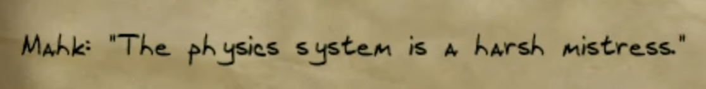

# darkness

`darkness`, an open [Dark Engine](https://en.wikipedia.org/wiki/Dark_Engine)(tm), is built on the headless core of the [openDarkEngine](https://github.com/volca02/openDarkEngine) project, and is optimized for a modular design permitting extensibility and full cross-platform compatibility on modern hardware. It aims to support all previously-generated official and fan content, and admit modular access to modernizing the graphics, audio, physics, and AI stacks.




### Prerequisites

- CMake 3.21+
- C++17 compiler (Clang, GCC, or MSVC)
- Git (for vcpkg submodule)

Dependencies are managed automatically via [vcpkg](https://vcpkg.io/) manifest mode:
bgfx, GLM, SDL2, zziplib, ODE, yaml-cpp, Catch2.

### Building

```bash
# Clone with vcpkg submodule
git clone --recursive https://github.com/example/darkness.git
cd darkness

# Configure and build (Debug)
cmake --preset default
cmake --build build/default

# Or Release
cmake --preset release
cmake --build build/release
```

This produces two binaries:

| Binary | Path | Description |
|--------|------|-------------|
| `darknessHeadless` | `build/default/src/main/darknessHeadless` | Mission inspector (dumps chunks, objects, properties) |
| `darknessRender` | `build/default/src/main/darknessRender` | World geometry viewer (SDL2 + bgfx) |

#### Platform presets

| Preset | Platform | Notes |
|--------|----------|-------|
| `default` | macOS / auto-detect | Debug build |
| `release` | macOS / auto-detect | Release build |
| `linux-x64` | Linux | Debug build |
| `windows-x64` | Windows | Debug build |

### Usage

Users must supply their own legally obtained game files. `darkness` does not include any game assets.

#### World viewer (`darknessRender`)

```bash
# Flat-shaded (no external resources needed)
darknessRender path/to/miss6.mis

# Textured + lightmapped (requires Thief 2 RES directory with fam.crf)
darknessRender path/to/miss6.mis --res /path/to/THIEF2/RES

# With bicubic lightmap filtering (smoother shadows)
darknessRender path/to/miss6.mis --res /path/to/THIEF2/RES --lightmap-filtering bicubic

# Enable camera collision and vintage physics rate
darknessRender path/to/miss6.mis --res /path/to/THIEF2/RES --collision --physics-rate 12
```

The `--res` path should point to a directory containing `fam.crf`, which holds the PCX textures used by Dark Engine levels. This can come from:

1. **Mounted ISO (macOS):** `hdiutil mount ../disk_images/thief_2_disk_1.iso` then `--res /Volumes/THIEF2_INSTALL_C/THIEF2/RES`
2. **GOG/Steam install directory:** `--res /path/to/Thief2/RES`
3. **Any directory containing fam.crf**

#### Configuration

Settings can be specified in a YAML config file, via CLI flags, or changed at runtime. Precedence is: **YAML defaults < CLI flags < runtime changes**.

Copy `darknessRender.example.yaml` to `darknessRender.yaml` in your working directory, or use `--config <path>` to point to a custom config file.

#### Controls — Fly mode

The default camera mode is physics model. Switch to fly/noclip using BS+P.

| Key | Action |
|-----|--------|
| WASD | Move forward / left / back / right |
| Mouse | Look around |
| Space / Q | Move up |
| LShift / E | Move down |
| LCtrl | Sprint (3x speed) |
| Scroll wheel | Adjust movement speed (shown in title bar) |
| Home | Teleport to player spawn point |
| Esc | Quit |

#### Controls — Physics mode (BS+P to enter)

Walk-on-ground mode with gravity, collision, jumping, crouching, and leaning.

| Key | Action |
|-----|--------|
| WASD | Walk / strafe |
| Mouse | Look around |
| Space | Jump (when on ground) |
| LShift | Creep (0.5x speed, hold) |
| LCtrl | Run (2x speed, hold) |
| C | Toggle crouch |
| Q / E | Lean left / right |
| Home | Teleport to player spawn point |
| Esc | Quit |

#### Debug shortcuts (hold Backspace + key)

| Keys | Action |
|------|--------|
| BS+P | Toggle physics / fly mode |
| BS+C | Toggle portal culling on/off |
| BS+F | Cycle texture filtering (point / bilinear / trilinear / anisotropic) |
| BS+L | Toggle lightmap filtering (bilinear / bicubic) |
| BS+V | Toggle camera collision (fly mode only) |
| BS+M / BS+N | Cycle model isolation forward / backward |
| BS+G | Toggle physics diagnostic log (`physics_log.csv`) |
| BS+R | Toggle raycast debug visualization |

#### Debug console

Press **\` (backtick)** to open the in-game settings console. Type to filter settings by name, Tab to auto-complete, arrow keys to navigate, Enter to select and edit. Press backtick or Esc to cancel.

Available console settings:

| Setting | Type | Description |
|---------|------|-------------|
| `filter_mode` | point / bilinear / trilinear / anisotropic | Texture filtering mode |
| `lightmap_filtering` | bilinear / bicubic | Lightmap filter quality |
| `portal_culling` | on / off | Portal/frustum culling |
| `camera_collision` | on / off | Camera clips to world geometry |
| `physics_mode` | on / off | Physics (walk) vs fly (noclip) |
| `physics_rate` | vintage / modern / ultra | Physics timestep (12.5 / 60 / 120 Hz) |
| `show_objects` | on / off | Render object meshes |
| `show_fallback_cubes` | on / off | Show colored cubes for missing models |
| `show_raycast` | on / off | Debug raycast visualization |
| `step_log` | on / off | Stair step diagnostics to stderr |
| `move_speed` | 1.0 - 500.0 | Camera movement speed (fly mode) |
| `wave_amplitude` | 0.0 - 5.0 | Water vertex wave height |
| `uv_distortion` | 0.0 - 0.5 | Water UV wobble strength |
| `water_rotation` | 0.0 - 0.5 | Water UV rotation speed (rad/s) |
| `water_scroll` | 0.0 - 1.0 | Water UV scroll speed |

#### CLI reference

| Flag | Default | Description |
|------|---------|-------------|
| `<mission.mis>` | *(required)* | Path to mission file |
| `--res <path>` | *(none)* | Thief 2 RES directory (enables textured+lightmapped rendering) |
| `--config <path>` | `./darknessRender.yaml` | Path to YAML config file |
| `--lightmap-filtering <mode>` | `bilinear` | Lightmap filtering: `bilinear` or `bicubic` |
| `--filter` | off | Start with bilinear texture filtering (default: point) |
| `--collision` | off | Start with camera collision enabled |
| `--no-objects` | off | Disable object mesh rendering |
| `--no-cull` | off | Start with portal culling disabled |
| `--show-fallback` | off | Show colored cubes for objects with missing models |
| `--force-flicker` | off | Force all animated lights to flicker mode |
| `--linear-mips` | off | Gamma-correct mipmap generation |
| `--sharp-mips` | off | Sharpen mip levels to preserve detail at distance |
| `--physics-rate <hz>` | `60` | Physics timestep: `12` (vintage), `60` (modern), `120` (ultra) |
| `--wave-amp <f>` | `0.3` | Water wave amplitude (0.0 - 10.0) |
| `--uv-distort <f>` | `0.015` | Water UV distortion (0.0 - 0.1) |
| `--water-rot <f>` | `0.015` | Water UV rotation speed in rad/s (0.0 - 1.0) |
| `--water-scroll <f>` | `0.05` | Water UV scroll speed (0.0 - 1.0) |
| `--step-log` | off | Log stair step diagnostics to stderr |
| `--debug-objects` | off | Dump per-object filtering diagnostics to stderr |
| `--help` | | Show help message |

#### Mission inspector (`darknessHeadless`)

```bash
darknessHeadless <database> [command] [args] [--scripts <path>]
```

Loads a `.mis`, `.gam`, or `.sav` database and inspects its contents.

| Command | Description |
|---------|-------------|
| `info` | File type, parent DB chain, chunk count (default) |
| `chunks` | List all chunks with name, version, size |
| `objects` | List all objects with ID, name, position |
| `properties [id]` | List all property types, or dump properties for a specific object |
| `links [id]` | List all relation types, or dump links for a specific object |

Use `--scripts <path>` to specify the schema directory (default: `scripts/thief2`).

### Thanks

* The openDarkEngine team.
* TomNHarris (telliamed) - for the all the work he has done understanding the Dark Engine and its data formats. Also for the irreplaceable help in the past.
* ShadowSpawn - For the BIN mesh format and Movement database format descriptions.
* ataricom - For helping out with the (now defunct) sourceforge Wiki
* The wonderfully obsessive TTLG community
* Conor Armstrong (SilentSleep) for Equilibrium, our test fixture (and great FM!)
* ...and others not mentioned

# Disclaimer
`darkness` is a reimplementation of the Dark Engine, drawing heavily from `opde`, and is not affiliated with or endorsed by the original software's rights holders or the `opde` team.

This project does not contain, distribute, or incorporate proprietary source code, binaries, assets, or data files from the original software. All code in this repository has been written by the project's contributors through independent development efforts. Users must supply their own legally obtained copies of any original game data files required to operate this software. This project does not facilitate, encourage, or provide access to pirated or unauthorized copies of any proprietary material.

### Intellectual Property
All original code in this repository is released under the GPLv3 license. See LICENSE for full terms.

The Dark Engine and any associated trademarks are the property of their respective owners. The use of these names within this project is solely for purposes of identification and interoperability, and does not imply any claim of ownership or affiliation.

### Purpose
This project exists to preserve access to The Dark Engine-based games on modern hardware and operating systems, in a context where the original software is no longer commercially available, maintained, or supported by its rights holders. It also aims to provide the opportunity for the fan community to extend the core functionality of the game to take advantage of modern hardware for non commercial purposes only.

### Good Faith
This project is developed and distributed in good faith, on a non-commercial basis, by volunteer contributors. Should any rights holder have concerns regarding this project, we welcome direct communication at [joseph at viviano dot ca] and are committed to addressing any legitimate concerns promptly and in good faith.
