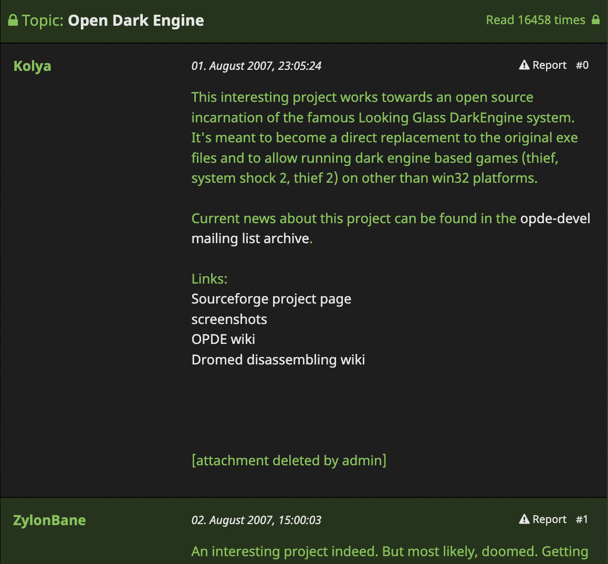

# darkness

`darkness`, an open Dark Engine(tm), is built on the headless core of the openDarkEngine project, and aims to be an extensible, cross platform implementation of the [Dark Engine](https://en.wikipedia.org/wiki/Dark_Engine). It aims to support all previously-generated official and fan content, and admit modular access to modernizing the graphics and AI stacks.



### Prerequisites

- CMake 3.21+
- C++17 compiler (Clang, GCC, or MSVC)
- Git (for vcpkg submodule)

Dependencies are managed automatically via [vcpkg](https://vcpkg.io/) manifest mode:
bgfx, SDL2, zziplib, ODE, yaml-cpp, Catch2.

### Building

```bash
# Clone with vcpkg submodule
git clone --recursive https://github.com/example/darkness.git
cd darkness

# Configure and build (Debug)
cmake --preset default
cmake --build build/default

# Or Release
cmake --preset release
cmake --build build/release
```

This produces two binaries:

| Binary | Path | Description |
|--------|------|-------------|
| `darknessHeadless` | `build/default/src/main/darknessHeadless` | Mission inspector (dumps chunks, objects, properties) |
| `darknessRender` | `build/default/src/main/darknessRender` | World geometry viewer (SDL2 + bgfx) |

#### Platform presets

| Preset | Platform | Notes |
|--------|----------|-------|
| `default` | macOS / auto-detect | Debug build |
| `release` | macOS / auto-detect | Release build |
| `linux-x64` | Linux | Debug build |
| `windows-x64` | Windows | Debug build |

### Usage

Users must supply their own legally obtained game files. `darkness` does not include any game assets.

#### World viewer

```bash
# Flat-shaded (no external resources needed)
darknessRender path/to/miss6.mis

# Textured + lightmapped (requires Thief 2 RES directory with fam.crf)
darknessRender path/to/miss6.mis --res /path/to/THIEF2/RES

# With upscaled lightmaps
darknessRender path/to/miss6.mis --res /path/to/THIEF2/RES --lm-scale 4
```

**Controls:**

| Key | Action |
|-----|--------|
| WASD | Move |
| Mouse | Look |
| Space / LShift | Up / Down |
| Ctrl | Sprint (3x) |
| Scroll wheel | Adjust speed |
| C | Toggle portal culling |
| F | Cycle texture filtering |
| V | Toggle collision |
| M / N | Cycle model isolation |
| Home | Teleport to spawn |
| Esc | Quit |

Run `darknessRender --help` for all options.

#### Mission inspector

```bash
darknessHeadless path/to/miss6.mis
```

Loads a `.mis` + `.gam` database and dumps chunk inventory, object hierarchy, properties, and links to stderr.

### Thanks

* The openDarkEngine team.
* TomNHarris (telliamed) - for the all the work he has done understanding the Dark Engine and its data formats. Also for the irreplaceable help in the past.
* ShadowSpawn - For the BIN mesh format and Movement database format descriptions.
* ataricom - For helping out with the (now defunct) sourceforge Wiki
* The wonderfully obsessive TTLG community
* Conor Armstrong (SilentSleep) for Equilibrium, our test fixture (and great FM!)
* ...and others not mentioned

# Disclaimer
`darkness` is a reimplementation of the Dark Engine and is not affiliated with or endorsed by the original software's rights holders.

This project does not contain, distribute, or incorporate proprietary source code, binaries, assets, or data files from the original software. All code in this repository has been written by the project's contributors through independent development efforts. Users must supply their own legally obtained copies of any original game data files required to operate this software. This project does not facilitate, encourage, or provide access to pirated or unauthorized copies of any proprietary material.

### Intellectual Property
All original code in this repository is released under the GPLv3 license. See LICENSE for full terms.

The Dark Engine and any associated trademarks are the property of their respective owners. The use of these names within this project is solely for purposes of identification and interoperability, and does not imply any claim of ownership or affiliation.

### Purpose
This project exists to preserve access to The Dark Engine-based games on modern hardware and operating systems, in a context where the original software is no longer commercially available, maintained, or supported by its rights holders. It also aims to provide the opportunity for the fan community to extend the core functionality of the game to take advantage of modern hardware for non commercial purposes only.

### Good Faith
This project is developed and distributed in good faith, on a non-commercial basis, by volunteer contributors. Should any rights holder have concerns regarding this project, we welcome direct communication at [joseph at viviano dot ca] and are committed to addressing any legitimate concerns promptly and in good faith.

