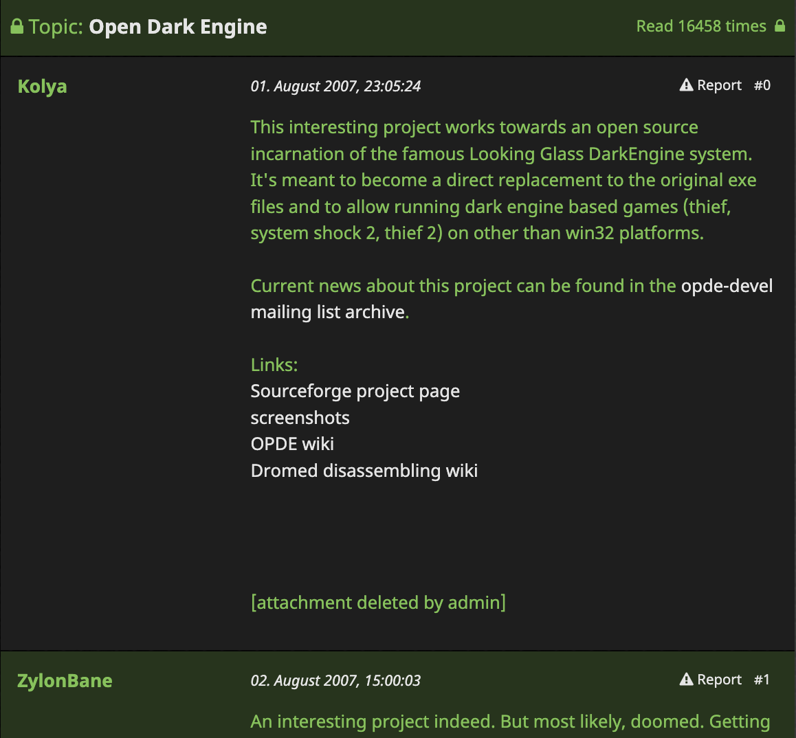
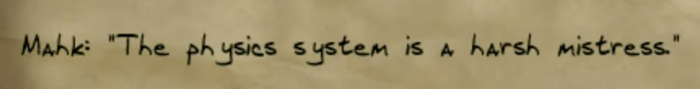

# darkness

`darkness`, an open [Dark Engine](https://en.wikipedia.org/wiki/Dark_Engine)(tm), is built on the headless core of the [openDarkEngine](https://github.com/volca02/openDarkEngine) project, and is optimized for a modular design permitting extensibility and full cross-platform compatibility on modern hardware. It aims to support all previously-generated official and fan content, and admit modular access to modernizing the graphics, audio, physics, and AI stacks.




### Prerequisites

- CMake 3.21+
- C++17 compiler (Clang, GCC, or MSVC)
- Git

Dependencies are managed automatically via [vcpkg](https://vcpkg.io/) manifest mode:
bgfx, GLM, SDL2, zziplib, ODE, yaml-cpp, Catch2, miniaudio, steam-audio.

### Building

```bash
# Clone the darkness repo
git clone <darkness-repo-url>
cd darkness

# Fetch and bootstrap vcpkg into ./vcpkg/ (gitignored)
git clone https://github.com/microsoft/vcpkg.git vcpkg
./vcpkg/bootstrap-vcpkg.sh   # or bootstrap-vcpkg.bat on Windows

# Configure and build (Debug)
cmake --preset default
cmake --build build/default

# Or Release
cmake --preset release
cmake --build build/release
```

The `default` preset wires vcpkg in via `vcpkg/scripts/buildsystems/vcpkg.cmake`; no extra toolchain flag is needed.

This produces two binaries:

| Binary | Path | Description |
|--------|------|-------------|
| `darknessHeadless` | `build/default/src/main/darknessHeadless` | Mission inspector (dumps chunks, objects, properties) |
| `darknessRender` | `build/default/src/main/darknessRender` | World geometry viewer (SDL2 + bgfx) |

#### Platform presets

| Preset | Platform | Notes |
|--------|----------|-------|
| `default` | macOS / auto-detect | Debug build |
| `release` | macOS / auto-detect | Release build |
| `linux-x64` | Linux | Debug build |
| `windows-x64` | Windows | Debug build |

### Usage

Users must supply their own legally obtained game files. `darkness` does not include any game assets.

#### World viewer (`darknessRender`)

`--res` is required; it must point to a directory containing `fam.crf` and `obj.crf` (the Dark Engine textures and object models).

```bash
# Textured + lightmapped
darknessRender path/to/miss6.mis --res /path/to/THIEF2/RES

# With sound schemas (enables spatial audio)
darknessRender path/to/miss6.mis --res /path/to/THIEF2/RES --schemas /path/to/EDITOR/SCHEMA
```

All other tunables (lightmap filtering, water parameters, physics rate, debug overlays, etc.) live in the YAML config — see `darknessRender.example.yaml`.

The `--schemas` path enables spatial audio by loading sound schemas. Resources and schemas can come from:

1. **Mounted ISOs (macOS):** `hdiutil mount ../disk_images/thief_2_disk_1.iso` then `--res /Volumes/THIEF2_INSTALL_C/THIEF2/RES` and `--schemas /Volumes/THIEF2_CD2/EDITOR/SCHEMA`
2. **GOG/Steam install directory:** `--res /path/to/Thief2/RES`
3. **Any directory containing fam.crf and obj.crf**

#### Configuration

Settings can be specified in a YAML config file, via CLI flags, or changed at runtime via the debug console. Precedence is: **YAML defaults < CLI flags < runtime changes**.

Copy `darknessRender.example.yaml` to `darknessRender.yaml` in your working directory, or use `--config <path>` to point to a custom config file. The YAML file has sections for `graphics`, `water`, `physics`, `audio`, and `developer` settings. See the example file for full documentation of all options, including spatial audio reflection parameters and the master bus DSP chain (limiter, compressor, EQ, ducking).

#### Controls — Physics mode (default)

Walk-on-ground mode with gravity, collision, jumping, crouching, and leaning. Toggle to fly mode via the debug console (`physics_mode` = off).

| Key | Action |
|-----|--------|
| WASD | Walk / strafe |
| Mouse | Look around |
| Space | Jump (when on ground) |
| LShift | Creep (0.5x speed, hold) |
| LCtrl | Run (2x speed, hold) |
| C | Toggle crouch |
| Q / E | Lean left / right |
| Home | Teleport to player spawn point |
| ` (backtick) | Open debug console |
| Esc | Quit |

#### Controls — Fly mode

Noclip free-look camera. Enable via the debug console (`physics_mode` = off).

| Key | Action |
|-----|--------|
| WASD | Move forward / left / back / right |
| Mouse | Look around |
| Space, Q | Move up |
| LShift, E | Move down |
| LCtrl | Sprint (3x speed) |
| Scroll wheel | Adjust movement speed (shown in title bar) |
| Home | Teleport to player spawn point |
| ` (backtick) | Open debug console |
| Esc | Quit |

#### Debug console

Press **\` (backtick)** to open the in-game settings console. All runtime settings are managed here — there are no separate keyboard shortcuts for toggling features.

**Interaction:** Type to filter settings by name, Tab to auto-complete, Up/Down arrows to navigate the list, Enter to select and edit. For bool/categorical settings, use Left/Right arrows to cycle values. For float settings, type a new value. Enter applies, backtick or Esc cancels.

##### Rendering

| Setting | Type | Description |
|---------|------|-------------|
| `filter_mode` | point / bilinear / trilinear / anisotropic | Texture filtering mode |
| `lightmap_filtering` | bilinear / bicubic | Lightmap filter quality |
| `portal_culling` | on / off | Portal/frustum culling |
| `show_objects` | on / off | Render object meshes |
| `show_fallback_cubes` | on / off | Show colored cubes for missing models |
| `show_raycast` | on / off | Debug raycast visualization |
| `show_acoustic_mesh` | on / off | Cyan wireframe overlay of acoustic scene geometry |
| `isolate_model` | all / (model names) | Isolate a single object model for inspection |

##### Camera & Physics

| Setting | Type | Description |
|---------|------|-------------|
| `physics_mode` | on / off | Physics (walk) vs fly (noclip) |
| `physics_rate` | vintage / modern / ultra | Physics timestep (12.5 / 60 / 120 Hz) |
| `physics_log` | on / off | Write per-timestep diagnostics to `physics_log.csv` |
| `camera_collision` | on / off | Camera clips to world geometry (fly mode only) |
| `move_speed` | 1.0 - 500.0 | Camera movement speed (fly mode) |
| `step_log` | on / off | Stair step diagnostics to stderr |

##### Water

| Setting | Type | Description |
|---------|------|-------------|
| `wave_amplitude` | 0.0 - 5.0 | Water vertex wave height |
| `uv_distortion` | 0.0 - 0.5 | Water UV wobble strength |
| `water_rotation` | 0.0 - 0.5 | Water UV rotation speed (rad/s) |
| `water_scroll` | 0.0 - 1.0 | Water UV scroll speed |

##### Audio — Spatial Reflections

| Setting | Type | Description |
|---------|------|-------------|
| `refl_enabled` | on / off | Real-time hybrid reflection reverb (convolution head + parametric tail) |
| `portal_routing` | on / off | Sound routing through doorways via portal graph |
| `probe_pathing` | on / off | Baked probe diffraction (when .probes file available) |
| `refl_rays` | 128 - 8192 | Rays per reflection sim step |
| `refl_bounces` | 1 - 8 | Bounces per ray |
| `refl_duration` | 0.5 - 4.0 | Convolution-head IR length in seconds (tail length is RT60-driven, derived from baked probe data) |
| `refl_throttle` | 1 - 32 | Run reflection sim every Nth frame |
| `refl_max_voices` | 1 - 32 | Max active reflection voices |
| `transmission_scale` | 0.1 - 100.0 | Material transmission multiplier (read-only at runtime) |
| `refl_tri_count` | *(read-only)* | Acoustic scene triangle count |
| `refl_sample_rate` | *(read-only)* | Reflection-effect sample rate |
| `refl_ambi_order` | *(read-only)* | Ambisonics order (0=omni, 1=directional) |

##### Audio — Probes & Recording

| Setting | Type | Description |
|---------|------|-------------|
| `bake_probes` | *(action)* | Set to "on" to re-bake acoustic probes |
| `probe_count` | *(read-only)* | Current probe count |
| `record_audio` | on / off | Start/stop audio recording to file |

#### CLI reference

The CLI is intentionally minimal — all runtime tunables live in the YAML config (see `darknessRender.example.yaml`) and can be changed live via the debug console.

| Flag | Default | Description |
|------|---------|-------------|
| `<mission.mis>` | *(required)* | Path to mission file |
| `--res <path>` | *(required)* | Thief 2 RES directory containing `fam.crf` and `obj.crf` |
| `--schemas <path>` | *(none)* | Path to schemas directory (enables spatial audio) |
| `--config <path>` | `./darknessRender.yaml` | Path to YAML config file |
| `--help` / `-h` | | Show help message |

Unknown flags are ignored with a warning.

#### Mission inspector (`darknessHeadless`)

```bash
darknessHeadless <database> [command] [args] [--scripts <path>]
```

Loads a `.mis`, `.gam`, or `.sav` database and inspects its contents.

| Command | Description |
|---------|-------------|
| `info` | File type, parent DB chain, chunk count (default) |
| `chunks` | List all chunks with name, version, size |
| `objects` | List all objects with ID, name, position |
| `properties [id]` | List all property types, or dump properties for a specific object |
| `links [id]` | List all relation types, or dump links for a specific object |

Use `--scripts <path>` to specify the schema directory (default: `scripts/thief2`).

### Thanks

* The openDarkEngine team.
* TomNHarris (telliamed) - for the all the work he has done understanding the Dark Engine and its data formats. Also for the irreplaceable help in the past.
* ShadowSpawn - For the BIN mesh format and Movement database format descriptions.
* ataricom - For helping out with the (now defunct) sourceforge Wiki
* The wonderfully obsessive TTLG community
* Conor Armstrong (SilentSleep) for Equilibrium, our test fixture (and great FM!)
* ...and others not mentioned

# Disclaimer
`darkness` is a reimplementation of the Dark Engine, drawing heavily from `opde`, and is not affiliated with or endorsed by the original software's rights holders or the `opde` team.

This project does not contain, distribute, or incorporate proprietary source code, binaries, assets, or data files from the original software. All code in this repository has been written by the project's contributors through independent development efforts. Users must supply their own legally obtained copies of any original game data files required to operate this software. This project does not facilitate, encourage, or provide access to pirated or unauthorized copies of any proprietary material.

### Intellectual Property
All original code in this repository is released under the GPLv3 license. See LICENSE for full terms.

The Dark Engine and any associated trademarks are the property of their respective owners. The use of these names within this project is solely for purposes of identification and interoperability, and does not imply any claim of ownership or affiliation.

### Purpose
This project exists to preserve access to The Dark Engine-based games on modern hardware and operating systems, in a context where the original software is no longer maintained or supported by its rights holders. It also aims to provide the opportunity for the fan community to extend the core functionality of the game to take advantage of modern hardware for non commercial purposes only.

### Good Faith
This project is developed and distributed in good faith, on a non-commercial basis, by volunteer contributors. Should any rights holder have concerns regarding this project, we welcome direct communication at [joseph at viviano dot ca] and are committed to addressing any legitimate concerns promptly and in good faith.
